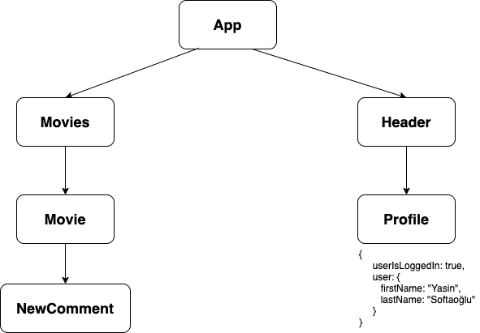
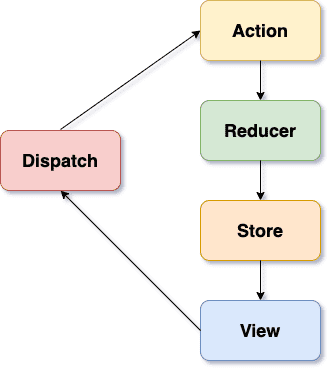

# React-Redux

### Bu projemde react-redux kullanımı ile ilgili çalışmalara yaptım öncelikle kısaca bahsetmek gerekirse kullandığım kütüphaneler

- redux
- redux/toolkit
- redux-persist

# Redux nedir?

### Redux özetle state management yani uygulama genelinde olan bitenleri yönetebileceğimiz bir javascript kütüphanesidir. Uygulamamızdaki modalların yönetimden, kullanıcı giriş çıkışına kadar tüm dinamik işlemleri redux ile kontrol edebiliriz. Ayrıca redux çok geniş bir community'e sahip olduğu için sorunlarınızı çözmekte ve uygulamanızın ihtiyacı olan paketleri bulmakta zorlanmayacaksınız.

# State Nedir?

### Redux kütüphanesini kavrayabilmek için önce state kavramının ne olduğuna yakından bakmamız gerekir. State uygulama için gerekli ve uygulamanın lifecycle'ı içerisinde dinamik olarak değişebilen ve yönetilmesi gereken değişkenlerin bulunduğu bir javascript objesidir.

### React.js kullanırken tanımladığımız state ile redux kullanırken tanımladığımız state arasındaki tek fark redux state'inin uygulama genelini kapsaması yani global bir state olmasıdır.

# Neden redux kullanmalıyız?

### Yazılımcılar olarak bazen trendleri fazla önemseyip yaptığımız geliştirmeyi komplex hale getirebiliyoruz. Yani yazılımcı daima basit düşünmelidir ilkesine ters düşebiliyoruz. Bu yüzden önce öğrenmek veya kullanmak istediğimiz aracın ortaya çıkma sebeplerini ve çözdüğü problemleri iyice analiz etmemiz gerekiyor.

### Ufak bir tavsiyeden sonra neden redux kullanmalıyız ve react'taki state mekanizmasından farkı ne gibi soruları cevaplamaya çalışalım. Öncelikle react.js'de state'ler her zaman component bazlı oluşturulur ve props yardımı ile diğer component'lara aktarılır.

### 💡 State'i props yardımıyla kullanmak isteyen component, state'nin tanımlandığı component'in child component'i olmak zorundadır.



### Yukarıdaki görseli incelemeye çalışalım. Profile component'inde kullanıcı bilgileri ve giriş yapılma durumu ile ilgili react state'i oluşturulmuş. Bu da demek oluyor ki kullanıcı ile ilgili tüm logic'i Profile component'i barındırıyor. Kullanıcı bilgilerine NewComment component'inde de ihtiyacımız olduğunu varsayalım. Bu durumda aşağıdaki yollardan birini izlememiz gerekecek.

### Kullanıcı bilgileri ile ilgili state'i App component'ine taşımak

### Profile component'indeki state ve kontrollerin aynısını NewComment component'ine taşımak

### 🚫 Aşağıda açıklayacağım nedenlerden dolayı bu yolları tercih etmek mantıklı olmayacaktır.

### Birinci yolu kullanmamalıyız çünkü ileride ne kadar nested component'a sahip olacağımızı bilemeyiz. 10 seviye alttaki bir component'a kullanıcı bilgilerini props ile taşımak çok doğru olmayacaktır.

### İkinci yolu da kullanmamalıyız çünkü kullanıcı bilgilerine ihtiyaç duyan component arttıkça code duplicate (kod tekrarı) problemleri ortaya çıkacaktır.

### İşte tam bu noktada redux devreye giriyor. Uygulama genelinde bir state oluşturup dilediğimiz component'in bu state'e kolayca ulaşabilmesi için redux kullanıyoruz 😍.

# Redux temelleri nelerdir?

### Redux aşağıdaki dört temel yapıdan oluşur. Hepsinden teker teker ve detaylı bir şekilde bahsetmeye çalışacağım.

- Actions
- Dispatch
- Reducers
- Store

# Actions

### Redux'ın uygulama genelinde global bir state oluşturduğunu söylemiştik. Actions ise bu global state'e gönderilecek verinin gövdesidir.

### 💡 Bir action her zaman javascript objesi olmak zorundadır.

### Bir action genellikle type ve payload olmak üzere iki adet property'den oluşur. type action'un belirteçi hangi işlemin yapıldığını belirtir. payload ise gönderilecek veriyi içeren property'dir. payload yerine gönderdiğiniz verinin adını da (movie, comment vs.) yazabilirsiniz fakat genel bir kural olarak payload property'sini kullanmaya özen göstermelisiniz.

# Dispatch

### Dispatch bir redux method'udur ve redux state'ini güncellemek için kullanılır. Dispatch method'u parametre olarak yukarıda bahsettiğimiz action tipinde bir obje alır.

# Reducers

### Reducers global state'in güncellendiği, kontrol edildiği ve güncellenmiş state'i return eden klasik bir javascript function'udur. Aşağıda açıklacağım iki parametre alır:

- state: uygulamanın geçerli state'i
- action: global state'i güncellemek için gönderilen action
- Reducer oluşturmak için aşağıdaki kurallara uymak zorundasınız.

### Reducer'ın state parametresini her zaman başlangıç state'ine eşitleyin.

### Oluşturduğunuz reducer her zaman benzersiz bir obje dönmelidir. .push(), .splice() gibi methodlar yerine spread operator, concat() veya Object.assign() gibi yöntemler kullanın.

### Bahsettiğim kurallara uygun reducer örneğimizi yukarıda oluşturmak olduk. Dilerseniz switch/case yerine if/else yapısını da kullanabilirsiniz.

# Store

### Yazının bu kısmına kadar bahsettiğimiz global state'in redux karşılığı store'dur. Tüm reducer'ların birleşimiyle oluşturulur. Redux store oluşturmak için redux içinde bulunan createStore() method'unu kullanırız.

### Redux ile oluşturduğumuz store objesinde aşağıdaki üç adet method bulunur.

- store.getState(): güncel state objesini verir.
- store.dispatch(): reducer'a state'i güncellemesi için action gönderir.
- store.subscribe(): store'da oluşan değişiklikleri dinler.

### Redux'ın çalışma prensibi nedir?

### Redux'ın nasıl çalıştığını anlamak için güzel ve sade bir grafik hazırladım. Bu grafik üzerinden sırayla redux'ın nasıl bir çalışma prensibi olduğunu anlatmaya çalışacağım.



- Kullanıcı view'da herhangi bir action dispatch eder.
- Action dispatch method'u ile reducer'a iletilir.
- İletilen action reducer'da işlendikten sonra global store güncellenir.
- Store'daki güncellemeler view'a yansıtılır.

# Redux nasıl kurulur?

### Şu ana kadar redux hakkında fazlasıyla teorik fakat faydalı bilgiye sahip olduk. Yazının bu kısmından itibaren sadece redux kullanarak ufak bir yorum sistemi yapmaya çalışacağız. Localinizde veya Codesandbox gibi online araçları kullanarak bir proje oluşturabilirsiniz. Projeyi oluşturduğunuzu varsayıp redux kurulumuna geçelim.

### Redux' ister npm veya yarn ile isterseniz de cdn aracılığı ile projenize ekleyebilirsiniz. Gerçek bir proje deneyimi için npm veya yarn'ı seçmek mantıklı olacaktır.

```jsx
npm install redux
```

### Redux/toolkit ne işe yarar

```jsx
npm install @redux/toolkit
```

### Redux Toolkit paketi, Redux mantığını yazmanın standart yolu olmasını amaçlamıştır. Temel Redux da ki karmaşıklığı ve fazladan kod yazmanın önüne geçilmesi sağlanmıştır. Store yapılandırması daha kolay hale gelmiştir. Paket kurulumları için kolaylıklar getirilmiştir.

# configureStore()

### Reducer ların tanımlanmasını sağlayan yapıdır. Genelde store adında klasör içerisinde index.js veya store.js içerisinde tanımlaması yapılır.

# combineReducer()

### configureStore içerisinde kullanılır, reducer ların combine (birleştirmek) için kullanılır. configureStore içerisinde syntax olarak configureStore tanımlamak biraz okunurluğu azalttığını düşünüyorum.

# createSlice()

### Slice komponent lerin oluşturulmasını sağlar.

### createSlice içerisinde ; name, initialState ve reducers tanımlamalarını yapmamız gerekmektedir.

- name : Reducer adı.

- initialState : başlangıç State i.

- reducers : çalıştırılacak function lar.

# createReducer()

### Export olarak reducer tanımlaması ve dışa aktarımı sağlanıyor.

# CreateAction()

### export olarak dışa aktarılacak actions lar belirleniyor. Burada {} bu şekilde tanımlama yapmadan da kullanımı sağlanıyor, ama ben bu kullanımı daha temiz bulduğum için bu yapıyı kullanıyorum.

# useDispatch()

### createSlice içerisinde tanımlanan actionsların çalıştırılması için kullanılır.

# useSelector(state => state.reducer)

### Reducer içerisinde tanımlanan state bilgisine erişmek ve değişikliklerden haberdar olmak için kullanılır.

- createSlice ile Reducer işlemlerimizi ve action işlemlerimizi yapıyoruz.

- store.js içerisinde recucerları combine liyoruz.

- İndex.js içerisinde en tepede Provider store {} kullanımını sağlıyoruz.

- useDispatch veya useSelector kullanımını komponentler içerisinde sağlıyoruz.

